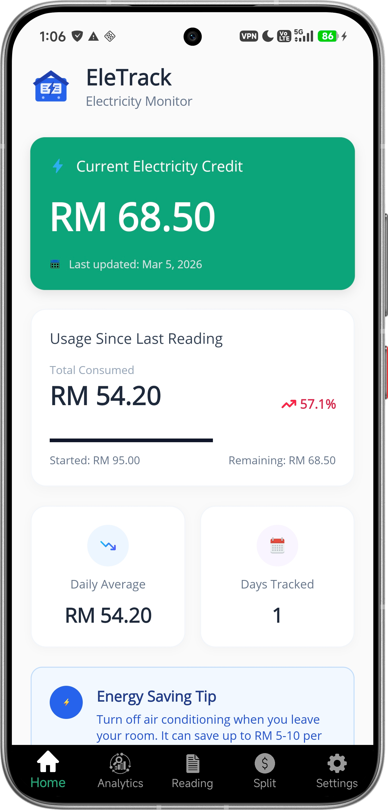
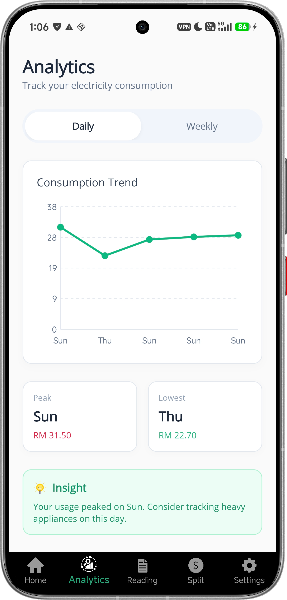
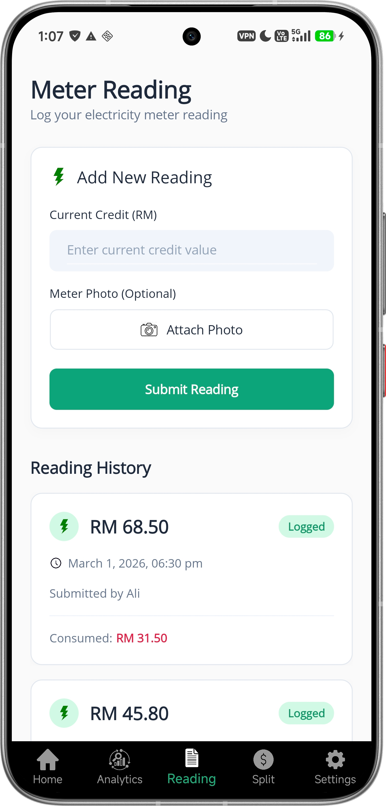
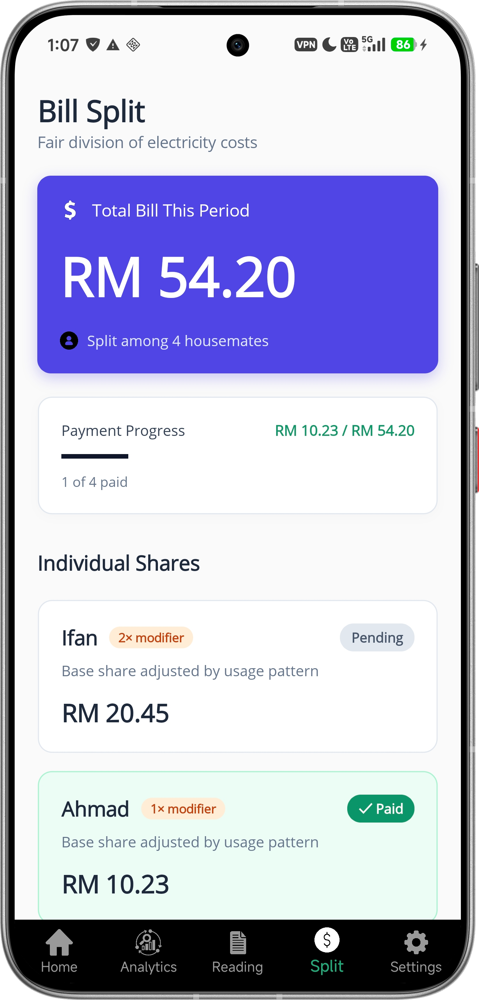
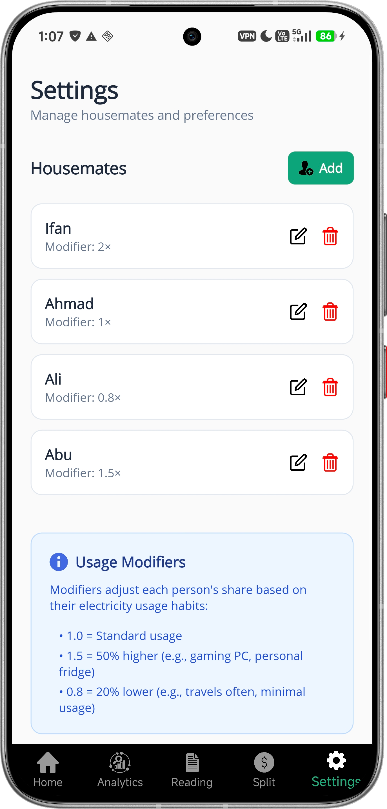

# ⚡ EleTrack - Household Electricity Tracker
## 📱 App Preview

  
  
  
  
  

EleTrack is a cross-platform mobile application designed to help university students track their shared electricity usage and fairly split bills among housemates. Built as a UNITEN case study, this app eliminates manual calculations, prevents disputes over utility costs, and promotes energy-conscious habits. 

## 🎯 The Problem
Students in shared campus accommodations often struggle with managing prepaid electricity bills. Manual tracking leads to lost data, and splitting bills evenly is often unfair to students who consume less power than housemates with heavy appliances (like gaming PCs or personal fridges).

## 💡 The Solution
EleTrack automates the entire process from meter reading to bill splitting. By utilizing cloud synchronization and customizable usage modifiers, the app provides a transparent, dispute-free way to manage shared expenses. 

## ✨ Key Features
* **Automated Bill Splitting:** Automatically calculates consumed credit and divides costs among housemates based on individual usage modifiers.
* **Customizable Usage Modifiers:** Assign weighted multipliers (e.g., 1.5x for high-consumption users, 0.8x for minimal users) to ensure fair cost distribution.
* **Verified Meter Readings:** Users can log current prepaid credit and attach timestamped photographic evidence of the physical meter to prevent disputes.
* **Real-time Synchronization:** Powered by Firebase, all readings, photos, and bill breakdowns are instantly synced across all housemates' devices.
* **Interactive Analytics:** Visualizes daily and weekly consumption trends via line and bar graphs to help users identify spikes in usage.
* **Exportable Summaries:** Generate clear bill breakdowns that can be shared via screenshots for easy e-wallet reimbursement.

## 🛠️ Tech Stack
* **Framework:** .NET MAUI 
* **Languages:** C#, XAML 
* **Database & Storage:** Firebase Cloud Storage / Realtime Database
* **Architecture:** Object-Oriented Programming (OOP)

## 📱 App Interface Overview
EleTrack features a streamlined UI categorized into five core pages:
1. **Home:** Displays current electricity credit, recent usage, and daily energy-saving tips.
2. **Analytics:** Interactive charts for tracking consumption trends over custom date ranges.
3. **Meter Reading:** The input form for logging new data and uploading photo evidence.
4. **Bill Split:** A dynamic dashboard showing total costs, individual shares, and payment progress.
5. **Settings:** Profile management and usage modifier configuration.

## 🎓 Academic Disclaimer
This application was developed as a milestone project for the course **CSNB5123 - Mobile Application Development** at Universiti Tenaga Nasional (UNITEN). It is intended primarily for educational purposes, academic assessment, and portfolio demonstration.
